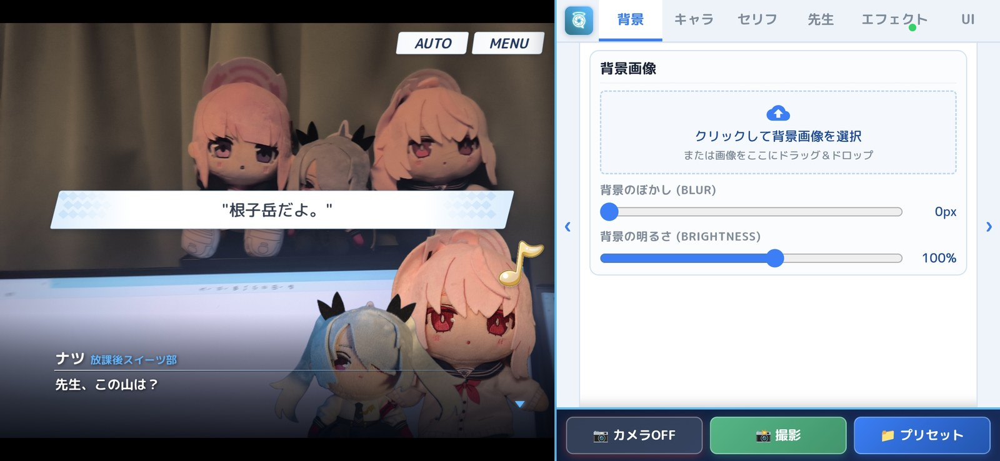
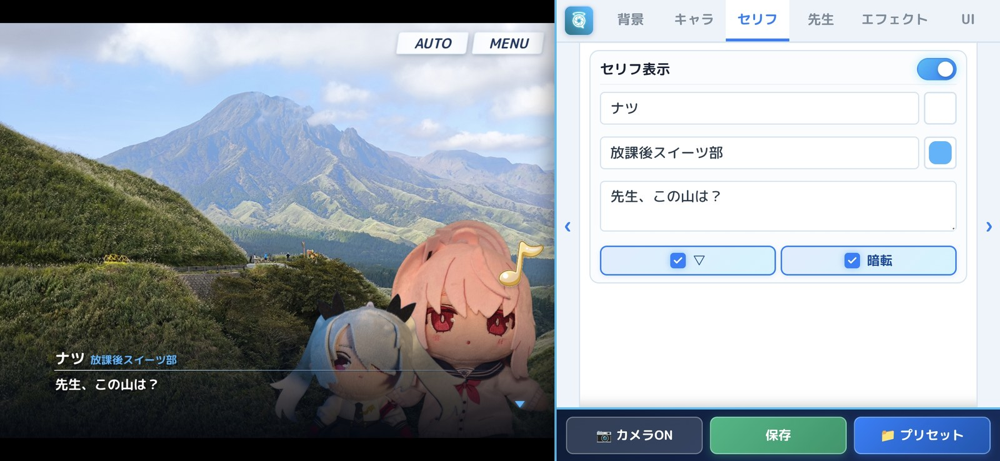
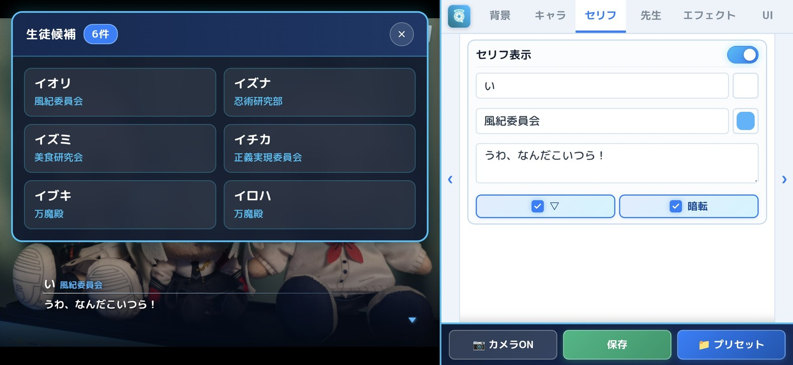
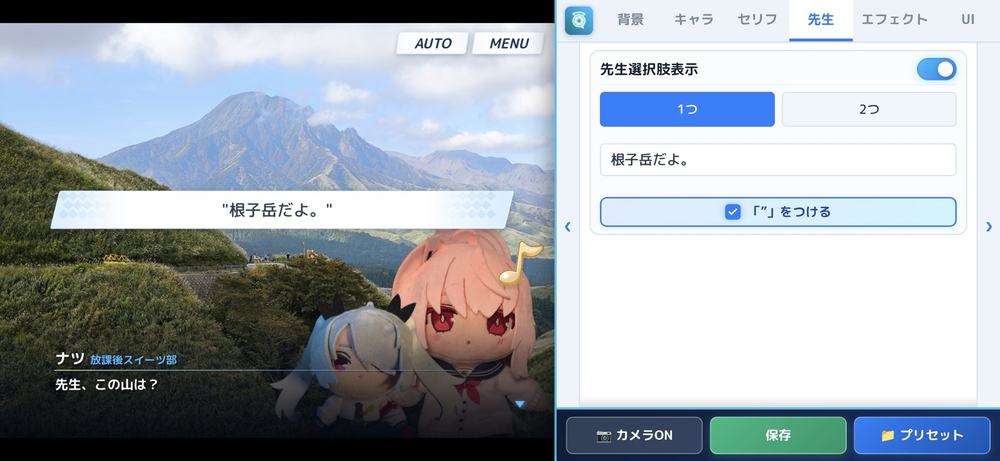
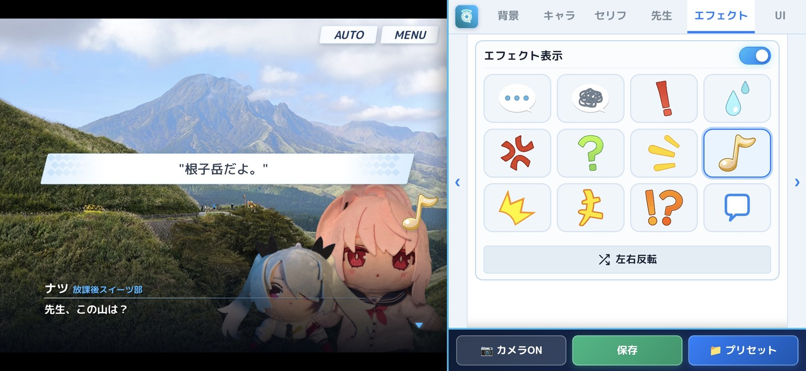
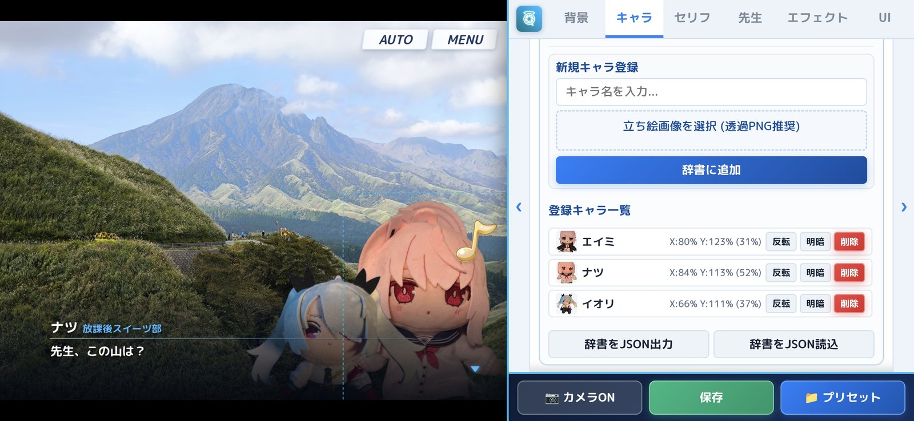
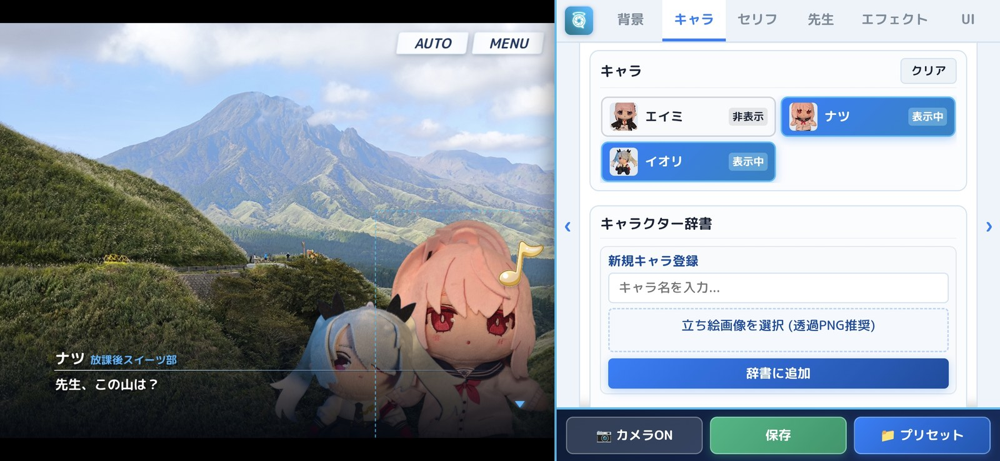

# BlueArchive Scene Maker

ブルーアーカイブ（ブルアカ）のゲーム内シナリオ画面（会話シーン、先生の選択肢、エモート吹き出し、UIボタン等）を忠実に再現し、好みの背景画像やスマートフォンのカメラ映像とリアルタイムに重ね合わせて撮影・高解像度保存できるクリエイター向けツールです。

<p align="center">
  <a href="./BlueArchive_Scene_Maker.apk">
    
  </a>
</p>

<p align="center">
  
</p>

---

## 🌟 主な機能と画面紹介

### 1. リアルタイム カメラ重ね合わせ撮影 (AR)
- スマートフォンの背面カメラと連動し、現実の風景やぬいぐるみ、日常のワンシーンの上に生徒の立ち絵やセリフ、エモートを重ねて直接シャッターを切ることができます。
- 横画面構え時にスマートフォンの物理カメラレンズ位置と自然に一致する**左側プレビュー／右側操作パネル**設計。

<p align="center">
  
</p>

---

### 2. セリフ枠 ＆ 生徒名・所属の自動サジェスト入力
- **忠実なブルアカ風セリフ枠**: キャラクター名、所属部活・組織名、本文、シアンのグラデーションアンダーライン、▼インジケーターを再現。
- **生徒名・所属の瞬時サジェスト**: 名前をひらがなまたはカタカナで1文字打つだけで、前方一致で生徒候補が左画面に一覧表示。タップするだけで**生徒名と対応する所属組織が自動入力**されます（選択を外すと自動で閉じる快適設計）。

<p align="center">
  
  
</p>

---

### 3. 先生の選択肢ウィンドウ
- ブルアカ特有の平行四辺形ウィンドウ、ライトシアンのダイヤパターン、ダブルクォート引用符を再現。
- 選択肢数は「1つ」または「2つ」をワンタップで切り替え可能です。

<p align="center">
  
</p>

---

### 4. エモート吹き出し（左右反転対応）
- ゲーム内で馴染み深い各種エモート（汗、怒りマーク、キラキラ、点々、？、！、ぐるぐる、音符、フラッシュ、きっ、！？等）を多数収録。
- **左右反転ボタン**を搭載し、キャラクターの向きに合わせてワンクリックで反転可能。配置位置や拡大縮小も直感的に行えます。

<p align="center">
  
</p>

---

### 5. 生徒立ち絵管理・キャラクター辞書
- 透過PNG画像を読み込んで画面上に複数人自由に配置可能。
- **キャラクター辞書機能**: よく使う立ち絵を名前付きで登録しておけば、いつでもワンタップで画面への表示／非表示を切り替えられます。
- キャンバス上のドラッグ操作による直感的な位置調整やスケール調整に対応。

<p align="center">
  
  
</p>

---

### 6. 直前の変更に戻る・進む (Undo / Redo)
- 編集画面の右下隅にスタイリッシュな **Undo / Redo ボタン（`↶` / `↷`）** を配置。
- セリフやエフェクト、配置位置の調整などを最大40手まで記憶し、いつでも1手ずつ戻したりやり直したりできます（PC操作時の `Ctrl + Z` / `Ctrl + Y` ショートカットにも対応）。

---

## 📱 アプリの利用方法

### 1. Android アプリとして利用する場合

[](./BlueArchive_Scene_Maker.apk)

- リポジトリ直下に配置されている **[`BlueArchive_Scene_Maker.apk`](./BlueArchive_Scene_Maker.apk)** をタップ/クリックしてダウンロードし、Android端末にインストールしてください。
- 初回起動時にカメラ権限を許可することで、カメラ撮影モードがご利用いただけます。

### 2. PC・ブラウザで利用する場合
1. `start.bat` を起動するか、以下のコマンドでローカルサーバーを起動します:
   ```bash
   python server.py
   ```
2. ブラウザで `http://localhost:8000/index.html` にアクセスします。
3. 同一Wi-Fiネットワーク上のスマートフォンからアクセス可能なローカルIPアドレスもコンソールに表示されます。

---

## 📂 プロジェクト構成

```
bluearchive-scene-maker/
├── index.html        # Webアプリ本体・UI構造
├── style.css         # スタイルシート（ブルアカ風デザイン）
├── app.js            # レンダリングエンジン＆カメラ制御
├── effects.js        # エモートスプライトデータ
├── effects/          # エモート透過PNG素材
├── fonts/            # 同梱オープンソースフォント (M PLUS Rounded 1c)
├── docs/             # ドキュメント用画像素材
│   └── images/       # README用スクリーンショット
├── sample_park.jpg   # 初期サンプル背景画像
├── start.bat         # PCローカル起動バッチ
├── server.py         # ローカルサーバー
├── android-app/      # Android Studio (Kotlin + WebView) プロジェクト
└── README.md         # 本ドキュメント
```

---

## 🔤 フォントライセンスについて

本プロジェクトに同梱・使用されているフォントは、オープンソース（SIL Open Font License 1.1）に基づいて提供されている **M PLUS Rounded 1c** です。
- **M PLUS Rounded 1c**: Copyright (c) 2015, Coji Morishita, M+ FONTS PROJECT (https://fonts.google.com/specimen/M+PLUS+Rounded+1c)

---

## ⚠️ 免責事項

本ソフトウェアは、ファンによって作成された非公式のファンメイドツール（二次創作ツール）です。
「ブルーアーカイブ」および関連するすべての知的財産権は、NEXON Games Co., Ltd. および 株式会社Yostar に帰属します。
